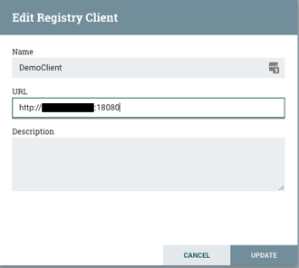
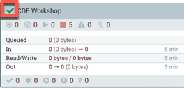
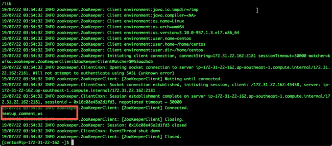

# CDF-CDH Labs: Real-time sentiment analysis with NiFi, Kafka, Spark, Python, Kudu, Impala and Hue.

--

### Pre-requisites

You would require an environment where the following are installed and configured:

* Cloudera CDH (Impala, Kudu, Hue)
* Cloudera Data Flow (Nifi, Registry)

We provide instructions to deploy a single node CDH cluster with all the above pre-requisites configured and installed [Github Repo](https://github.com/rajatrakesh/OneNodeCDHCluster)

Using this repo, you can bring up a CDH cluster (also includes CDSW deployment instructions as well). Alternatively, you can also deploy it as an instance on AWS using a public AMI available (for Cloudera Workshops ONLY). 

To prepare the environment:

* Deploy the OneNodeCluster using [Github Repo](https://github.com/rajatrakesh/OneNodeCDHCluster). This is an extension of the fantastic work done by my colleague **Fabio**. His original repo is available [here](https://github.com/fabiog1901/OneNodeCDHCluster) 

OR 

* Launch the AWS AMI **TBD** with **TBD** instance type.

--

## Content
### Section 1

* [Lab 1 - Accessing the sandbox](#accessing-the-sandbox)
* [Lab 2 - Stream data using NiFi](#stream-data-using-nifi)
* [Lab 3 - Explore Kafka](#explore-kafka)
* [Lab 4 - Spark Streaming w/ Python](#stream-with-spark)
* [Lab 4 - Explore Kudu, Impala](#explore-kudu-impala)
* [Lab 5 - Stream enhanced data into Kudu](#stream-enhanced-data-into-kudu)
* [Lab 6 - Create live dashboard with Hue](#create-live-dashboard-with-hue)

### Section 2
* [Lab 1 - Collect syslog data using MiNiFi and EFM](#collect-syslog-data-using-minifi-and-efm)

## Accessing the sandbox

### Add an alias to your hosts file

On Mac OS X, open a terminal and vi /etc/hosts

On Windows, open C:\Windows\System32\drivers\etc\hosts

Add a new line to the existing

```xx.xx.xx.xx	demo.cloudera.com```

Replacing the ip (xx.xx.xx.xx) address with the one provided by Cloudera during the workshop. If you are launching this in your own private AWS instance, then this would be the public IP for this instance. 

### Accessing Cloudera Manager for the first time and starting up all services. 

The following services are going to be installed, but initially only Cloudera Manager would be accessible as by default all services would be in shutdown state. 

- Cloudera Manager : 7180
- NiFi : 8080/nifi
- NiFi Registry : 18080/nifi-registry
- Hue : 8888
- CDSW : cdsw.'public-ip of aws instance'.nip.io

Login to Cloudera Manager with username/password ```admin/admin```, and familiarize yourself with all the services installed.  For the first startup, especially for CDSW, it could take up to 20 mins. 

**After a successful startup, all services would be showing a green tick.**


## Preparing your instance for labs

There are a few configuration files and scripts that need to be downloaded in your instance, before we can start with the labs. A summary of these is as follows:

* Install Unzip
* Download Standford NLB package - [CoreNLP - Natural language software](https://stanfordnlp.github.io/CoreNLP/)
* Unzip the Stanford NLP package
* Download Kudu Spark Jar file
* Download Spark Core Jar file
* Setup Environment Variable ```kafka_dir``` to the Kafka Installation Directory
* Setup Environment Variable ```localip``` to the local (private ip) of your instance
* Setup Environment Variable ```publicip``` to the public ip of your instance

The above setup as well as a few others have been provided in scripts that you can download from here by issueing the following command in terminal/putty:

```$ wget xx.xx.xx.xx/config_lab.sh```
```$ chmod +x config_lab.sh```
```$ ./config_lab.sh```

This script would download/setup all the above required dependencies and will also download a bunch of housekeeping scripts that we would use during the labs. These would be available in the home folder as well. (/home/centos)

## Stream data using NiFi

### Run the sentiment analysis model as a REST-like service

For the purpose of this exercise we are not going to train, test and implement a classification model but re-use an existing sentiment analysis model, provided by the Stanford University as part of their 

The Stanford NLP Engine would be setup in the directory ```/home/centos/stanford-corenlp-full-2018-10-05```

To start the NLP Engine Server, execute the following script:

```$ ./1_start_nlp.sh```

**Referene**: This starts the server by executing the following command:

```bash
cd /path/to/stanford-corenlp-full-2018-10-05
java -mx1g -cp "*" edu.stanford.nlp.pipeline.StanfordCoreNLPServer -port 9999 -timeout 15000 </dev/null &>/dev/null &
```

Details on the corenlp server are available here [web service](https://stanfordnlp.github.io/CoreNLP/corenlp-server.html)

The script ```1_start_nlp.sh``` will run in the background on port 9999 and you can visit the [web page](http://yourpublicip:9999/) to make sure it's running.


To test out the engine, remove all annotations and use **Sentiment** only. 

The model will classify the given text into 5 categories:

- very negative
- negative
- neutral
- positive
- very positive

### Build NiFi flow

In order to have a streaming source available for our workshop, we are going to make use of the publicly available Meetup's API and connect to their WebSocket.

The API documentation is available [here](https://www.meetup.com/meetup_api/docs/stream/2/event_comments/#websockets): https://www.meetup.com/meetup_api/docs/stream/2/event_comments/#websockets

In this scenario we are going to stream all comments, for all topics, into NiFi and classify each one of them into the 5 categories listed above. 

To do that we need to score each comment's content against the Stanford CoreNLP's sentiment model. 

In real-world use case we would probably filter by event of our interest but for the sake of this workshop we won't and assume all comments are given for the same event: the famous CDF workshop!

Let's get started... Open [NiFi UI](http://demo.cloudera.com:9090/nifi/) and follow the steps below:

- **Step 1: Adding a Processor Group**
	- Drag the Processor Group to the Canvas and give it a name 'CDF Workshop'. 
	- Click Add.
	- Double click the Processor Group and it will show up a blank canvas (inside the group).


- **Step 2: Enabling Nifi Registry**
	- Open the [Nifi Registry portal](http://demo.cloudera.com:18080/nifi-registry)
	- 
	- Let's add a bucket. Click the wrench icon in the right corner to open up the Bucket screen.
	- Let's create a new bucket and call it ```workshop```.
	- 
	- We would need to connect Nifi with Nifi Registry. 
	- Click the three hortizontal bar icon in the right top corner. Then click 'Controller Settigs'
	- 
	- Let's create a new registration for the client. **Note** For this option to work, you would need to open the port 18080, to not just your public IP (computer), but also the public IP of your instance. 
	- 
	- Add the url of Nifi Registry and click update.
	- 
	- Right click anywhere on the Nifi canvas and select 'Refresh' in the menu.
	- Right click again and this time select 'Version' -> 'Start Version Control'.
	- 
	- If everything is setup correctly, your bucket created earlier should get autoselected (being the only bucket).
	- Provide a name for the Flow - 'CDF Workshop' for example. 
	- You can also provide a description for your flow. 
	- Click Save.
	- 
	- A green tick will appear on your Processor Group indicating that your flow now has versipon control enabled. 
	- 

- **Step 3: Add a ConnectWebSocket processor to the canvas**
 	 - Double click on the processor
 	 - On settings tab, check all relationships except **text message**, as we want only a text message to go forward to subsequent flow. 
 	 - 
 	 - Got to properties tab and select or create **JettyWebSocketClient** as the WebSocket Client Controller Service
 	 - Go to properties tab and give a value to **WebSocket Client Id** such as **demo** for example
 	 -  
 	 - Then configure the service (click on the arrow on the right)
 	 - Go to properties tab and add this value: ```ws://stream.meetup.com/2/event_comments``` to property **WebSocket URI**
 	 - Apply the change
 	 - Enable the controller service (click on the thunder icon) and close the window
 	 - Apply changes
 	 - 
 	 
- **Step 4: Add an UpdateAttribute connector to the canvas**
	- Double click to open the processor. 
	- On properties tab add new property mime.type clicking on + icon and give the value ```application/json```. This will tell the next processor that the messages sent by the Meetup WebSocket is in JSON format.
	- Add another property ```event``` and give it a value ```CDF workshop for the purpose of this exercise.
	- Apply changes.
	- 

- **Step 5: Link ConnectWebSocket with UpdataAttribute processor**
	- Hover the mouse on the **ConnectWebSocket** processor and a link icon will appear
	-  
	- Drag and link this to the **UpdateAttribute** processor (green link will appear)
	- 
	- A property box will open up. 
	- Select only **text message**
	- 
	- The two processors are now linked
	- 

- **Step 6: Add EvaluateJsonPath processor to the canvas**
	- Double click the processor.
	- On Settings tab, select both **failure** and **unmatached** relationships
	- On properties tab, change **Destination** value to **flowfile-attribute**.
	- Add the following properties:
		- timestamp: $.mtime
		- member: $.member.member_name
		- country: $.group.country
		- comment: $.comment
	- The message coming out of the processor would look like this:

	```json
	{"visibility":"public","member":{"member_id":11643711,"photo":"https:\/\/secure.meetupstatic.com\/photos\/member\/3\/1\/6\/8\/thumb_273072648.jpeg","member_name":"Loka Murphy"},"comment":"I didn’t when I registered but now thinking I want to try and get one since it’s only taking place once.","id":-259414201,"mtime":1541557753087,"event":{"event_name":"Tunnel to Viaduct 8k Run","event_id":"256109695"},"table_name":"event_comment","group":{"join_mode":"open","country":"us","city":"Seattle","name":"Seattle Green Lake Running Group","group_lon":-122.34,"id":1608555,"state":"WA","urlname":"Seattle-Greenlake-Running-Group","category":{"name":"fitness","id":9,"shortname":"fitness"},"group_photo":{"highres_link":"https:\/\/secure.meetupstatic.com\/photos\/event\/9\/e\/f\/4\/highres_465640692.jpeg","photo_link":"https:\/\/secure.meetupstatic.com\/photos\/event\/9\/e\/f\/4\/600_465640692.jpeg","photo_id":465640692,"thumb_link":"https:\/\/secure.meetupstatic.com\/photos\/event\/9\/e\/f\/4\/thumb_465640692.jpeg"},"group_lat":47.61},"in_reply_to":496130460,"status":"active"}```
	- Link EvaluateJsonPath to UpdateAttribute processor 

- **Step 7: Add a AttributesToCSV processor to the canvas**
	- Double click to open the processor. 
	- On settings tab, select **failure** relationship
	- Change **Destination** value to **flowfile-content**
	- Change **Attribute List** value to write only the above parsed attributes: **timestamp,event,member,country,comment**
	- Set **Include Schema** to **true**
	- Apply changes
	- Link AttributesToCSV with EvaluateJsonPath on **matched** relationship

- **Step 8: Add a PutFile processor to the canvas**
	- Open the processor.
	- On settings tab, select **all** relationships - Since this will be the last connector in this flow, we need to terminate all relationships. 
	- Change **Directory** value to **/tmp/workshop**
	- Link PutFile process with AttributesToCSV processor on **success** relationship.
	- Apply Changes.

- **Step 9: Commit your first Flow**
	- Right click anywhere on the canvas.
	- Click 'Version' -> 'Commit Local Changes'.
	- .
	- Provide commentary for your Version.
	- .
	- Now goto Nifi Registry and you would be able to see the version information show up here as well. 
	- .

- **Step 10: Start your First Flow**
	- Click the Play icon on the 'CDF Workshop' Processor Group to start the entire flow. 
	- All the processors will now show a green play icon, as the processor start to execute. 
	- You will see flow-files starting to move and you can gradually see how the data is being read from meetup.com
	- .
	- To review the actual files being written, ssh to your instance and navigate to the ```/tmp/workshop``` directory.
	- You will see all the files being written here. You can select any one of them and issue a ```cat filename``` command to view the contents as well. 
	- .
	- Once done, stop the flow and delete the files created by this flow by typing:
	- ```sudo rm -rf /tmp/workshop/*```


## Configure and Explore Kafka

- **Setup Kafka Topic**
	- SSH to your instance. 
	- Normally, you would need to identify where kafka is installed and then execute a bunch of command line statements to create & list topics. There is a seperate utility for tracking what content is being written in Kafka. For this lab, we have parameterized these statements and provided them via scripts, making it easy to setup the lab.
	- **Note You can execute the set_env.sh script at the command line to populate the kafka_dir,localip & publicip variables at anytime. This is typically used, if you lose connectivity and need to run commands again.**
	- ```$ ./set_env.sh```
	- List Kafka Topics by executing the following:
	- ```$ ./list_kafka_topics.sh```
	- By default, your environment will not have any existing Kafka topics setup, hence no topics will be displayed. 
	- Let's create a Kafka Topic ```meetup_comment_ws``` by executing the following:
	- ```$ ./2_create_kafka_topic.sh meetup_comment_ws```
	- Let's check if the topic has been created by executing:
	- ```$ ./list_kafka_topics.sh```
	- .


	


	


